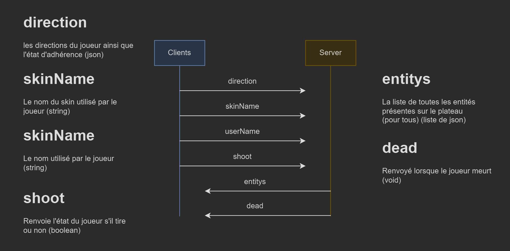
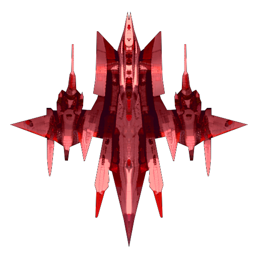
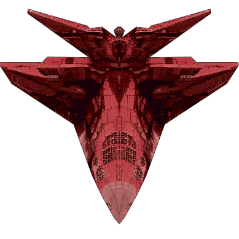
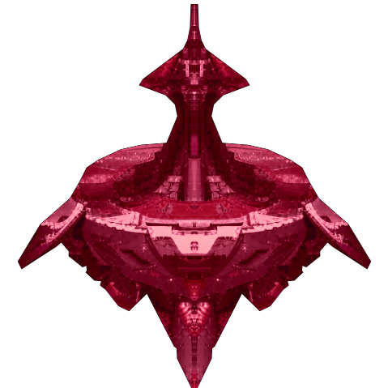

## Installation rapide

```bash
git clone https://gitlab.univ-lille.fr/samy.vancalster.etu/sae-2024-groupeI-benhaddouche-vancalster-haye.git` # Téléchargement du server / client

npm i # Installe les paquets requis 

npm run client:build # Compile le client

npm run server # Lance la partie serveur 
```

## Commandes utiles

- `npm run server:watch` : Compile automatiquement la partie serveur.

- `npm run client:watch` : Compile automatiquement la partie client.
	**[!!!] Parfois la commande bug, passez alors par `npm run client:build`**

- `npm run client:build` : Compile la partie client.

- `npm run test:watch` Lance la verification des tests.

## Échanges entre le client et le serveur via les websockets



Comme nous pouvons le voir avec notre diagramme, nous pouvons contrôler le client grâce au serveur et ainsi empêcher une personne mal intentionnée de tricher avec un client modifié.

## Difficultés techniques 

Nous avons rencontré énormément de difficultés car nous n'étions pas habitués à socket.io. De plus pendant les premières semaines, nous avions tous décidé de privilégier la SAÉ Pizzaland ainsi que le portfolio à réaliser en communication, dans le but pour certains de trouver un stage ou une alternance, ce qui nous a fait démarrer avec beacoup de retard.

La principale difficulté a été la réalisation des tests en TDD et la mise en place du client / serveur, heureusement socket.io est assez simple à comprendre notament grace au TP que nous avons rélisé en cours et qui peut être comparé à une mini saé. Nous avons donc réussi à rattraper notre retard, en nous concentrant sur ce TP et en passant beaucoup de temps sur le projet.

## Points d'améliorations/d'achèvements

Parmi les points d'améliorations et d'achèvements que nous pouvons citer, il y a helas des points qui étaient demandés dans le sujet de la Jsae.

Par exemple, nous aurions aimé avoir le temps de finaliser l'écran rejouer, avec l'affichage des différentes statistiques. Et aussi rajouter la possibilité de régler la difficulté du jeu (comme par exemple de choisir le nombre de vies du joueur).

Ensuite, nous aurions aimé faire des choses en plus, qui n'étaient pas demandées dans le sujet. Par exemple, nous aurions voulu créer des "salles" afin que les joueurs puissent jouer avec leurs amis, car pour le moment cela ressemble plutôt à un MMO.

Enfin, nous voulions également rajouter un petit scénario dans notre jeu, afin de le rendre plus attractif.

## Enfin, expliquez ce dont vous êtes le/la plus fier/fière

Il y a plusieurs choses dont nous sommes très fiers comme par exemple la direction artistique utilisée dans le jeu, qui a été entièrement générée par l'intelligence artificielle [Stable diffusion](https://github.com/AUTOMATIC1111/stable-diffusion-webui). Ce qui nous a permis de générer ce genre d'images :






Nous pouvons aussi citer la différenciation des mouvements entre les différents types d'ennemis, ce qui permet de les différencier grâce à leurs comportements bien distincts.

Enfin nous pouvons parler des mouvements qui sont très satisfaisant calvier en main ainsi qu'à l'écran. [exemple](https://www.youtube.com/embed/mZBsQsax-fY?)

<iframe width="560" height="315" src="https://www.youtube.com/embed/mZBsQsax-fY?si=3fUi3kldA56RhELO&amp;start=5" title="YouTube video player" frameborder="0" allow="accelerometer; autoplay; clipboard-write; encrypted-media; gyroscope; picture-in-picture; web-share" referrerpolicy="strict-origin-when-cross-origin" allowfullscreen></iframe>

## Conclusion

Nous sommes tous très contents d'avoir réalisé ce projet car il nous a permis d'en apprendre beaucoup sur la gestion du multijoueur, tout en créant un jeu et en utilisant un langage que nous avions jusque là peu utilisé. Malgré notre perte de temps au démarrage de la saé, nous avons réussi à rattraper notre retard sur la fin grâce à une bonne communication et un à bon travail d'équipe.